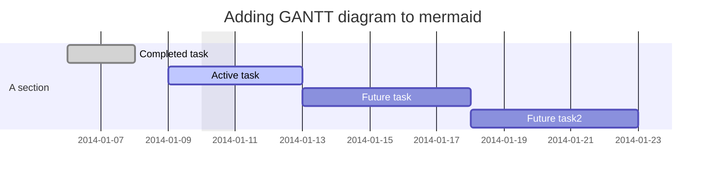

A paragraph with *emphasis* and **strong importance**.
> A block quote with ~strikethrough~ and a URL: https://reactjs.org.
* Lists
* [ ] todo
* [x] done

A table:

|                a                            |        b               |       c                |
|                -                            |        -               |       -                |
| :input{id=input-test-11 class='test-class'} | :input{.input-test-12} | :input{.input-test-13} |
| :input{.input-test-21}                      | :input{.input-test-22} | :input{.input-test-23} |




```falstad
$ 1 0.000005 10.20027730826997 50 5 43 5e-11
r 176 80 384 80 0 10
s 384 80 448 80 0 1 false
w 176 80 176 352 0
c 384 352 176 352 0 0.000015 -6.923563183975744 -10
l 384 80 384 352 0 1 0.026911944843541355 0
v 448 352 448 80 0 0 40 5 0 0 0.5
r 384 352 448 352 0 100
o 4 64 0 4099 20 0.05 0 2 4 3
o 3 64 0 4099 20 0.05 1 2 3 3
o 0 64 0 4099 0.625 0.05 2 2 0 3
38 3 F1 0 0.000001 0.000101 -1 Capacitance
38 4 F1 0 0.01 1.01 -1 Inductance
38 0 F1 0 1 101 -1 Resistance
h 1 4 3
```

# `react-data-grid` demonstration:
## Illuminance measurements at different wavelengths
:::div{id='parent'}
:dataTable{class='asdfdfsdfdsfsdfsf' table_id='table1' columns='[{ "key": "id", "name": "ID" } , { "key": "x", "name": "Wavelength [nm]" } , { "key": "y", "name": "Illuminance [lx]" }]' rows='[{ "id": "1", "x": "", "y": "" } , { "id": "2", "x": "", "y": "" } , { "id": "3", "x": "", "y": "" } , { "id": "4", "x": "", "y": "" } , { "id": "5", "x": "", "y": "" }]'}
:::

:dataTable{class='test' table_id='table2' columns='[{ "key": "id", "name": "ID" } , { "key": "x", "name": "Titleasdf" } , { "key": "y", "name": "TestCol" }]' rows='[{ "id": "0", "x": "", "y": "" } , { "id": "1", "x": "", "y": "" } , { "id": "2", "x": "", "y": "" }]'}

:chart{table_id='table1' chart_title='E_v = f(λ)' types='[scatter]' x='x' y='[y]'}
asdfasdfasd
:chart{table_id='table2' chart_title='table2' types='[scatter, bar]' x='x' y='[id, y]'}

:circuitSim{id='csim1'}

testetest
test

"Lorem ipsum dolor sit amet, consectetur adipiscing elit, sed do eiusmod tempor incididunt ut labore et dolore magna aliqua. Ut 

enim ad minim veniam, quis nostrud exercitation ullamco laboris nisi ut aliquip ex ea commodo consequat.

Duis aute irure dolor in reprehenderit in

voluptate velit esse cillum dolore eu fugiat nulla pariatur. Excepteur sint occaecat cupidatat non proident, sunt in culpa qui officia deserunt mollit anim id est laborum."

Code parser test:
:jsParser{id='parser-test'}
